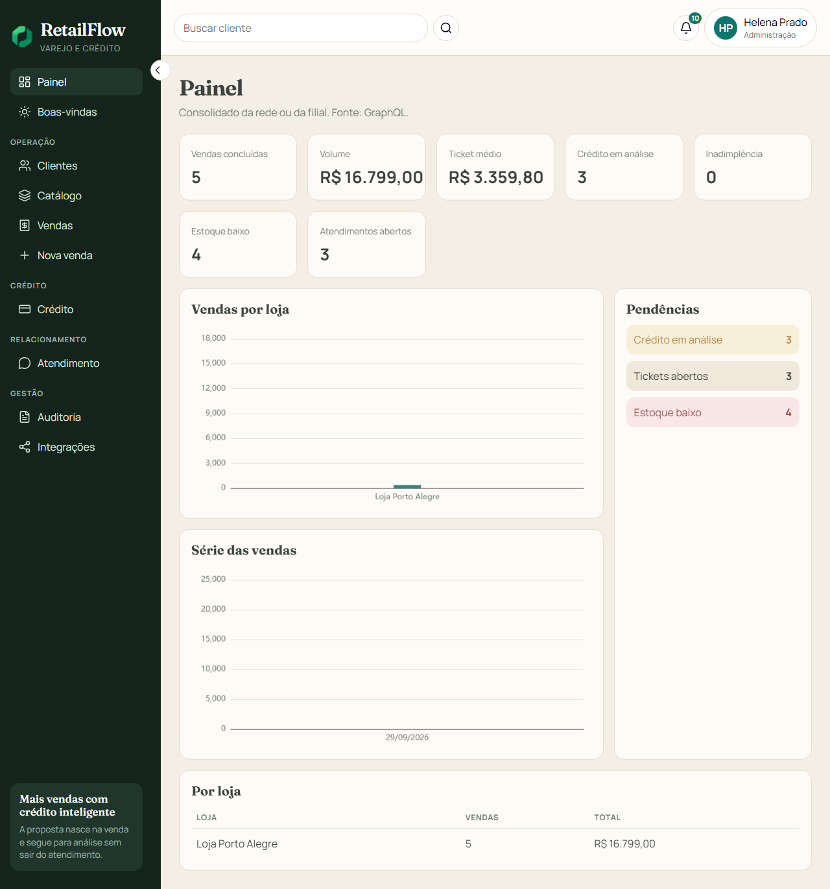
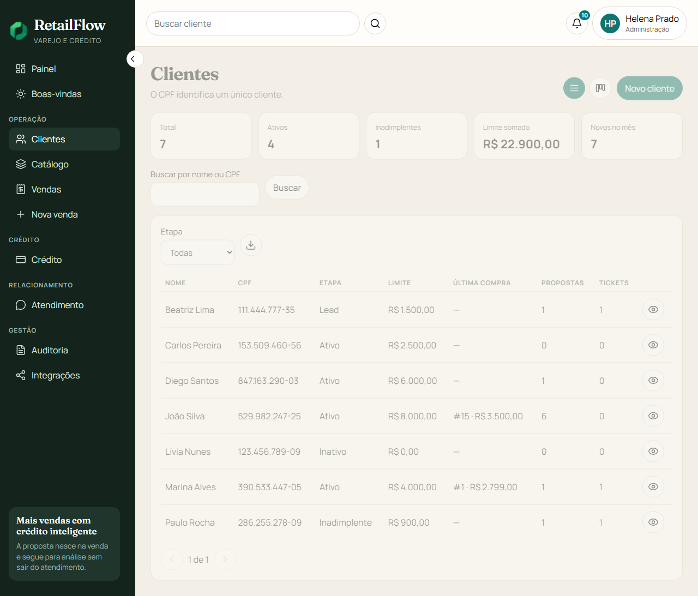
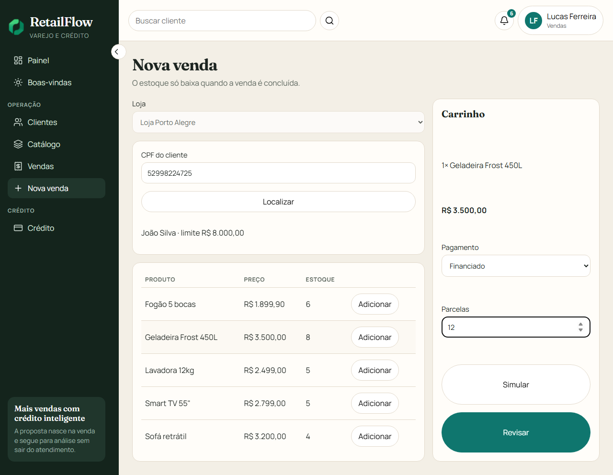
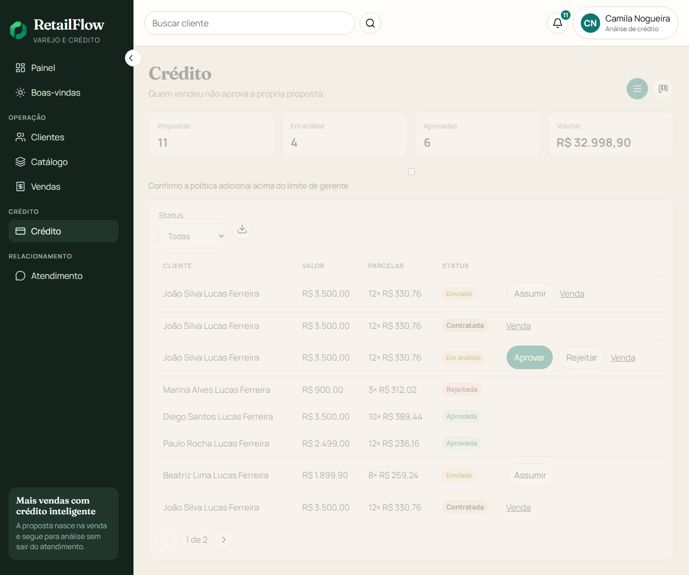
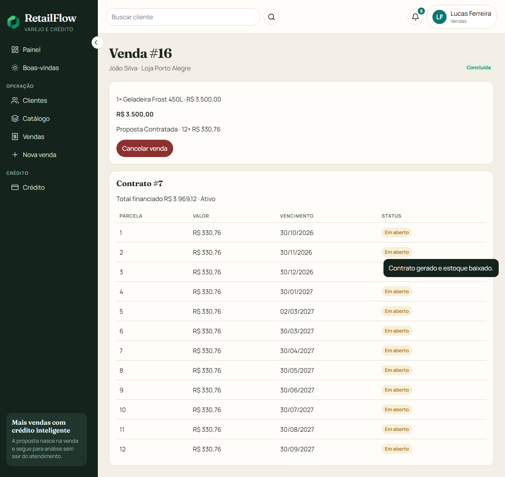

# RetailFlow

Plataforma de varejo e crédito para uma rede de lojas. O vendedor localiza o cliente, consulta o estoque da filial e fecha a venda à vista ou abre uma proposta de financiamento. A análise segue alçada. Só depois da aprovação o sistema gera contrato, parcelas e baixa o estoque.

O painel da v4 mostra mais do que a API já devolve: cartões, gráfico por loja, série das vendas listadas e resumo das listas. Não há meta, score nem comparação com período anterior.

## Acessos

Endereços do ambiente local, os mesmos do `.env.example`. Esta versão não publica domínio.

| Acesso | Endereço | Quem usa |
| --- | --- | --- |
| Painel da loja | http://localhost:5173 | Papéis da loja. A busca do topo abre a lista de clientes. |
| Admin | http://localhost:5174 | Só `super@retailflow.local`. Essa conta não entra no painel. |
| API | http://localhost:3000 | A raiz redireciona para a documentação. |
| Documentação da API | http://localhost:3000/api/docs | Swagger. |
| GraphQL | http://localhost:3000/api/v1/graphql | POST do consolidado. Se falhar, o painel lê o REST. |
| Saúde | http://localhost:3000/api/v1/health | Consulta pública. |
| Métricas | http://localhost:3000/api/v1/metrics | Formato Prometheus. |
| SQL Server | localhost:1433 | Banco `retailflow`, usuário `sa`. |
| Redis | localhost:6379 | Fila BullMQ. Sem Redis, um agendador interno drena o outbox. |

O parceiro não tem endereço próprio. A mesma API em `http://localhost:3000` atende o header `x-api-key` em catálogo, clientes e vendas.

## Subir localmente

1. Docker Desktop em execução.
2. Copie `.env.example` para `.env`.
3. `npm install`
4. `docker compose up -d`
5. `npm run db:setup`
6. `npm run dev:api` e, em outro terminal, `npm run dev:web`. O admin é `npm run dev:admin`.
7. Abra o [painel](http://localhost:5173). O [admin](http://localhost:5174) usa o superusuário do `.env`.

Senha de todos os usuários de demonstração, inclusive o superusuário: `RetailFlow#2026`

| Papel | E-mail | Onde entra |
| --- | --- | --- |
| Vendedor Porto Alegre | lucas.ferreira@retailflow.local | Painel |
| Vendedora Canoas | ana.martins@retailflow.local | Painel |
| Analista de crédito | camila.nogueira@retailflow.local | Painel |
| Gerente Porto Alegre | ricardo.almeida@retailflow.local | Painel |
| Financeiro | sofia.ribeiro@retailflow.local | Painel |
| Atendimento | bruno.teixeira@retailflow.local | Painel |
| Administração | helena.prado@retailflow.local | Painel |
| Superusuário | super@retailflow.local | Admin |

## Fluxo

À vista: localizar o cliente, montar o carrinho e confirmar. Venda, pagamento e baixa de estoque entram na mesma transação.

Financiado: a proposta nasce `SUBMITTED` e o estoque continua intacto. O analista assume a análise e aprova até R$ 5.000. De R$ 5.001 a R$ 15.000 a aprovação é do gerente. Acima disso, o gerente confirma a política adicional. Quem criou a proposta não a aprova. Com o crédito aprovado, a geração do contrato baixa o estoque e grava parcelas imutáveis.

O cliente João Silva (`529.982.247-25`) e a geladeira de R$ 3.500 estão no seed para esse roteiro. Porto Alegre começa com 12 unidades.

## O que o código cobre

- CPF único, usuário e loja ativos, auditoria de limite, cancelamento e eventos financeiros.
- Estoque por filial, sem saldo negativo, salvo permissão administrativa explícita.
- Pagamento idempotente por `externalTransactionId`.
- Outbox para Oracle, com BullMQ quando o Redis responde e agendador interno quando não responde.
- Tickets de atendimento, dashboard com inadimplência e estoque baixo, logs com `requestId` e métricas.
- Menu com categorias, ícone Lucide e quadro Dragula nas listas. Cliente tem etapa (`LEAD`, `ATIVO`, `INADIMPLENTE`, `INATIVO`). Venda e catálogo só organizam a leitura.
- Listas com resumo da página carregada, ordenação, filtro, paginação e CSV no navegador. O olho do cliente abre compras e tickets já gravados.
- Cadastro de cliente validado no modal. O POST segue `{ name, cpf, phone }`.
- Catálogo de conectores (Google Ads, Meta Ads, OpenAI, Gemini e Oracle) sem chamada externa. Ligar conector, guardar segredo e emitir chave ficam no admin.
- Chave de parceiro mostrada uma vez. Logos da empresa ficam em `uploads/`, fora do git.

## Documentos

Este README é o mapa. Cada página abaixo aprofunda um assunto.

| Documento | O que responde |
| --- | --- |
| [Arquitetura](docs/architecture/overview.md) | Módulos da API, pastas do painel e do admin, e o que a v4 mudou na tela |
| [Regras de negócio](docs/business-rules/README.md) | RN001 a RN014 e o arquivo de domínio de cada uma |
| [ADR 0001](docs/adr/0001-monolito-modular.md) | Por que um monólito NestJS, e por que o admin não é outro serviço |
| [ADR 0002](docs/adr/0002-transacao-venda-estoque.md) | Venda e baixa de estoque na mesma transação |
| [ADR 0003](docs/adr/0003-rbac.md) | Seis papéis da loja, superusuário fora da matriz e chave de parceiro |
| [ADR 0004](docs/adr/0004-outbox-oracle.md) | Fila de saída, BullMQ e o mock Oracle |
| [Paleta](docs/design/paleta.md) | Tokens de cor do painel e do admin |
| [Fontes](docs/design/fontes.md) | Fraunces nos títulos e Manrope na interface |

## Pastas

`base_dir`: raiz do repositório.

| Subpasta | Conteúdo |
| --- | --- |
| `apps/api` | API NestJS, Prisma e testes de domínio |
| `apps/web` | Painel Vue 3 |
| `apps/admin` | Admin Vue, só o superusuário |
| `packages/types` | Contratos compartilhados entre API e painel |
| `docs/adr` | Decisões de arquitetura |
| `docs/design` | Paleta e fontes |
| `docs/architecture` | Visão técnica |
| `docs/business-rules` | Regras RN001–RN014 |
| `docs/images` | Capturas do painel, dos clientes, do ponto de venda, da fila e do contrato |
| `e2e` | Playwright local: venda financiada, menu, listas e admin |
| `scripts` | Atalho do Prisma com o `.env` da raiz |
| `.cursor/skills` | Modal, paleta, fontes e ícone no lugar de palavra |
| `.github/workflows` | CI: lint, testes de domínio e build |

Na raiz também ficam `docker-compose.yml` (SQL Server e Redis), `package.json` (workspaces), `eslint.config.js` e `playwright.config.ts`.

```text
Painel 5173 ─┐
             ├─ REST / GraphQL → NestJS → SQL Server
Admin 5174  ─┘                      ├── Redis / BullMQ
                                    └── adaptador Oracle (mock)
```

## Testes

```text
npm test
npm run test:integration --workspace=@retailflow/api
npx playwright test
```

Os testes de integração e o Playwright precisam do SQL Server, da API e do painel no ar. O GitHub Actions roda os testes de domínio, o lint e o build.

## Imagens










