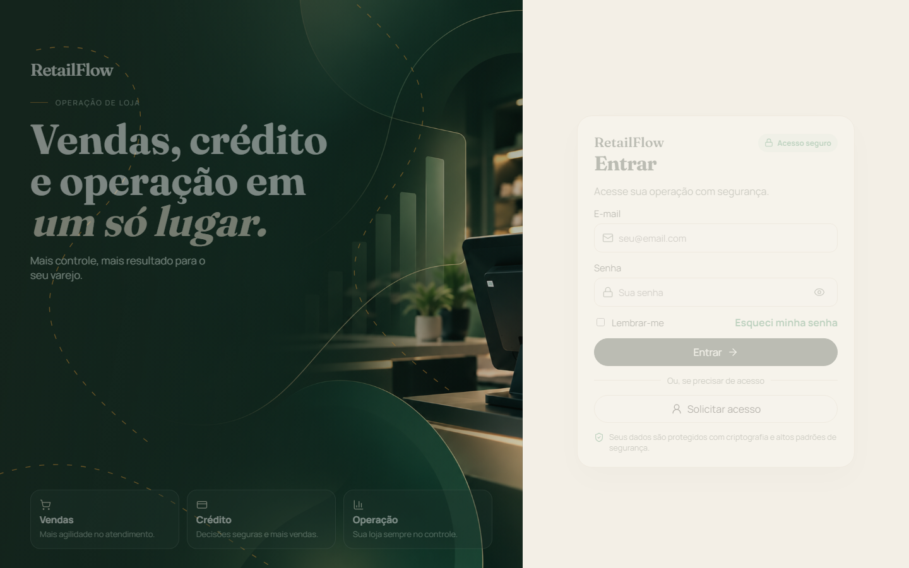

# Entrar

O painel e o admin são entradas diferentes. A mesma senha de demonstração não mistura as duas contas.

## Painel da loja

Abra http://localhost:5173. A tela pede e-mail e senha. Dá para mostrar a senha, marcar Lembrar-me e usar Entrar. Lembrar-me guarda só o e-mail neste navegador. Esqueci minha senha e Solicitar acesso explicam que o administrador da loja resolve isso. Não enviam e-mail.

| Papel | E-mail | Entra em |
| --- | --- | --- |
| Vendedor | lucas.ferreira@retailflow.local | Painel, filial Porto Alegre |
| Vendedora | ana.martins@retailflow.local | Painel, filial Canoas |
| Analista de crédito | camila.nogueira@retailflow.local | Painel |
| Gerente | ricardo.almeida@retailflow.local | Painel |
| Financeiro | sofia.ribeiro@retailflow.local | Painel |
| Atendimento | bruno.teixeira@retailflow.local | Painel |
| Administração | helena.prado@retailflow.local | Painel, inclusive Addons e Website |

A senha é `RetailFlow#2026`.

O menu mostra a categoria quando a conta tem a permissão da tela. Helena vê Addons e, com o website ativo, Website. Lucas vê a operação da filial dele e não vê Addons.

O superusuário `super@retailflow.local` é recusado neste login. Essa conta entra só em http://localhost:5174.

## O que a sessão carrega

O login devolve um token de oito horas e a lista de permissões do papel. Permissão de addon entra nessa lista quando a instalação da empresa está `ACTIVE`. Desativar o website tira `website.read` das próximas leituras da sessão. A tela `/admin/website` deixa de aparecer no menu.

`SUPERUSER` não está na matriz de papéis da loja. A chave de parceiro, no header `x-api-key`, também não é um papel. Ela lê catálogo, clientes e vendas.

## Onde isso mora

| Peça | Caminho |
| --- | --- |
| Tela de login | `apps/web/src/views/LoginView.vue` |
| Papéis e permissões | `apps/api/src/domain/permissions.ts` |
| Permissões do addon na sessão | `apps/api/src/modules/addons/addon.grants.ts` |
| Admin do superusuário | `apps/admin` |

A decisão do RBAC está em [ADR 0003](../adr/0003-rbac.md).

Próximo: [Operar a loja](03-operar.md).
