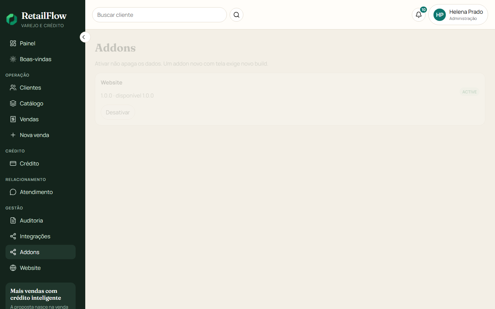
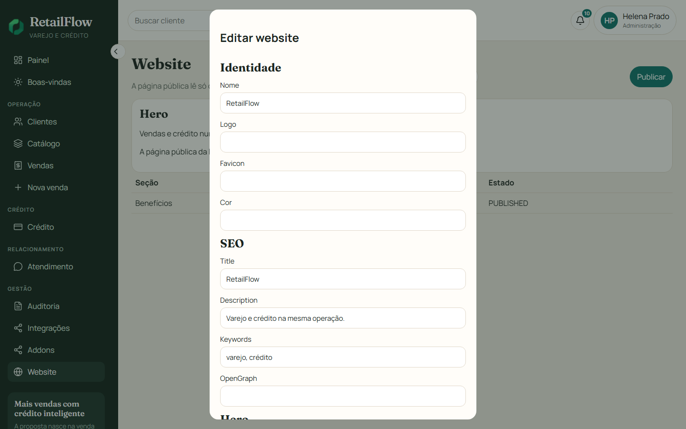

# Addons no painel

Um addon é um pacote na pasta `addons/`. A instalação é da empresa. Hoje existe uma empresa, `company`. Ativar ou desativar vale para ela e não pede um novo build. Colocar um pacote novo, com tela, pede rebuild do painel e do site.

Entre como `helena.prado@retailflow.local`. O item Addons fica em Gestão.

## O que a lista mostra

| Coluna na tela | Significado |
| --- | --- |
| Versão instalada | A que esta empresa aplicou |
| Versão disponível | A `version` do `manifest.json` na pasta |
| Estado | `INSTALLED`, `ACTIVE`, `INACTIVE`, `ERROR` ou `INCOMPATIBLE` |

Ativar deixa as rotas do pacote responderem. Desativar responde 404 nessas rotas e esconde o item Website do menu. Os dados ficam no banco.

Um manifesto inválido, uma versão fora de `>=6.0.0 <7.0.0` ou uma dependência ausente grava `ERROR` ou `INCOMPATIBLE`. A API continua. A mensagem aparece neste cartão.

## Editar o website

Com o estado `ACTIVE`, o menu ganha Website. A tela `/admin/website` mostra o hero guardado. Editar abre o modal com identidade, SEO, hero, contato, rodapé e as seções. Guardar grava o rascunho. Publicar copia o rascunho para o que o site público lê.

O superusuário do admin, na porta 5174, não recebe Addons nem Website.

## Onde isso mora

| Peça | Caminho |
| --- | --- |
| Tela de addons | `apps/web/src/modules/addons/AddonsView.vue` |
| Menu que soma o addon ativo | `apps/web/src/layouts/AppShell.vue` |
| Administração do website | `addons/website/frontend/WebsiteAdmin.vue` |
| Rotas da API | `POST /api/v1/addons/:name/activate` e `deactivate` |

Próximo: [Site público](05-site.md).
